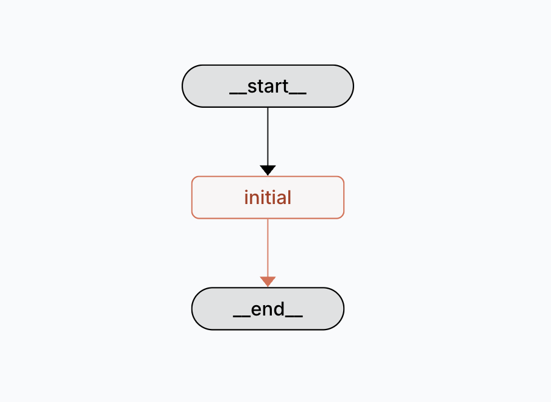
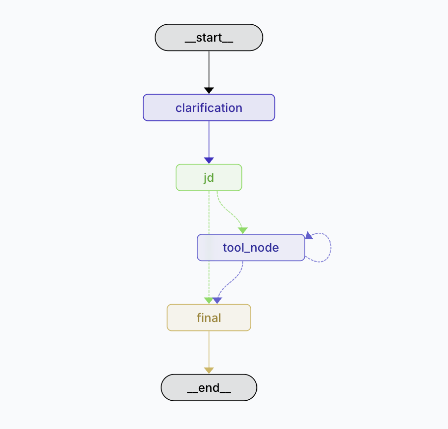

# Agentic AI Hiring Assistant

_A smart assistant designed to streamline and optimize the hiring process using Agentic AI System._

## Overview

The AI Hiring Assistant is a application that is created using LangGraph and LangChain frameworks to automate various stages of the recruitment process. The Assistant system uses Google Gemini model 'gemini-1.5-flash' to generate the content.
The project aims to assist hiring teams by:
- Generating a detailed Job Description using provided job details.
- Generating a hiring checklist for the job.
- Creating an email for candidate outreach.
- Drafting an offer letter.
- Using google search for gathering relevant information from the internet.


## Table of Contents

- [Overview](#overview)
- [Features](#features)
- [Installation](#installation)
- [How To Run The Project](#how-to-run-the-project)
- [How To Use](#how-to-use)
- [Tech Stack & Design Decisions](#tech-stack--design-decisions)
- [Future Enhancements & Recommendations](#future-enhancements--recommendations)
- [Contact](#contact)


## Features

The key features of the Agentic AI Hiring Assistant include:

- **Job Description Generation:** Agent generates a set of questions directly relevant to the role to gather details and automatically converts job details into a detailed job description.
- **Checklist Creation:** Produce structured hiring checklists relevant to the user query or the role to streamline recruitment processes.
- **Automated Communications:** Create candidate outreach emails and draft offer letters using AI-driven text generation.
- **Internet Research Integration:** Enhance outputs with real-time information gathered through integrated Google search.
- **Interactive Dashboard:** Built with Streamlit for an intuitive, real-time user interface.
- **Graph-based Workflow:** Utilize LangGraph and LangGraph Studio to visually manage and debug complex recruitment pipelines.
- **Modular Language Model Chains:** Leverage LangChain (including langchain-community, langchain-core, langchain-openai, langchain-google-genai, etc.) to create modular and extendable AI workflows.

## Installation

To get started with AI Hiring Assistant, follow these steps:

1. **Clone the Repository:**

   ```bash
   git clone https://github.com/PranjalPatil18/Agentic_AI_Hiring_Assistant.git

2. **Navigate to the project directory**
    ```bash
    cd/path_to_project/

3. **Install Dependencies:**

    Ensure you have Python 3.x installed, then run:
    ```bash
    pip3 install -r requirements.txt
    
4. **Set Up Environment Variables:**

    Create a .env file in the project root directory with GEMINI_KEY = "your_gemini_api_key".

## How To Run The Project

While in the project directory, open terminal and run the command. This will run the files on local host in your default browser. <br>
`streamlit run app.py`

## How To Use

1. **Enter the Role:**  
   Type the job title or role you wish to hire for (e.g., "Gen AI Intern") and click the **Submit** button.

2. **Provide Job Details:**  
   Fill in the job specifics such as required skills, qualifications, location, etc. Then, click the **Generate Job Description** button.  
   *Note:* You don't have to complete every field—only include the details you want to see in the final description.

3. **Interact with the Assistant:**  
   Use the text input box to request additional functionalities:
   - Generate a checklist for the hiring process.
   - Create a candidate outreach email.
   - Draft an offer letter.
   - Perform a web search for relevant information.
   - Edit the previously generated job description.

4. **Refine Your Content:**  
   After receiving the output, you can continue the dialogue in the same text box. Ask the assistant to further modify or expand the content as needed, or generate new outputs based on updated instructions.

Enjoy a streamlined, iterative process to create tailored recruitment documents and enhancements for your hiring workflow!


## Tech Stack & Design Decisions

### Tech Stack Used
- **Python & Environment Management:**
  - **Python 3.12.8:** The core language for the project.
  - **Dotenv:** For loading environment variables (e.g., `GEMINI_KEY`) ensuring secure API key management.
  
- **LLM Integration:**
  - **Gemini API via Google Models:** Utilized for content generation (`gemini-1.5-flash`) to power job description generation and tool outputs.
  
- **LangChain:**
  - **ConversationChain:** Wraps the Gemini LLM along with a conversation memory (via `ConversationBufferMemory`), enabling context retention across user interactions.
  
- **LangGraph:**
  - **StateGraph:** Organizes the recruitment workflow into modular nodes (e.g., `initial_node`, `clarification_node`, `jd_generation_node`).  
  - **ToolNode:** Manages the dynamic invocation of tools (such as email drafting, checklist generation, and content editing) by binding them directly to the LLM.
  
- **Streamlit:**
  - Provides an interactive frontend interface for recruiters. It handles form submissions for role entry, clarification inputs, and follow-up tool commands.
  
- **Analytics & Session Management:**
  - **SessionMemory:** Stores the conversation history and generated outputs for a consistent user experience.
  - **AnalyticsTracker:** Logs usage events (like role submission and tool invocations) to help monitor and improve the system.

### Key Design Decisions
- **Modular Workflow with Graph Architecture:**
  - **Node Separation:** The workflow is divided into multiple nodes:
    - **Initial Node:** Dynamically extracts the job role and generates clarifying questions.
    - **Clarification Node:** Processes recruiter responses to the generated questions.
    - **Job Description Generation Node (JD Generation):** Constructs a detailed job description based on the collected clarifications.
  - **Graph Separation:** Two distinct graphs are used:
    - **Input & Clarification Graph:** Handles gathering the initial job details and clarifications.
    - **Generation & Tool Invocation Graph:** Manages the creation of the job description and subsequently invokes the relevant tools based on user follow-up requests.
  - **Separation of Concerns:** This structure isolates the data collection phase from the content generation phase, simplifying debugging and future enhancements.

- **Tool Integration & Dynamic Conversation Flow:**
  - **Binding Tools to the LLM:** The tools (such as `write_outreach_email`, `generate_checklist`, `google_web_search`, `generate_offer_letter`, and `edit_content`) are seamlessly bound to the Gemini LLM using LangGraph’s `bind_tools` method and managed via a `ToolNode`.
  - **Cyclic and Conditional Flow:** The design supports a cyclic workflow allowing users to enter follow-up commands, modify outputs, or terminate tool interactions. Conditional routing (using methods like `route_after_jd` and `route_after_tool`) adds flexibility by determining when to switch between generation and tool-based editing.
  
- **Extensibility and Maintainability:**
  - **Modular Code Organization:** Separation of the agent (`agent.py`), tools (`tools.py`), and the UI (`app.py`) promotes easier maintenance, testing, and future expansion.

- **Visualizing the Workflow**

- **LangGraph Studio:**  
  To visualize the data flow and decision-making process of the assistant, LangGraph Studio can be used.  
  - **Command:** Run `langgraph dev` in the terminal to start the visualization.
  - **Diagrams:** Two separate graphs are generated:
    1. **Data Collection Graph:** Captures the flow from gathering the job role to clarifying details.
    2. **Job Description Generation Graph:** Details the flow from processing the provided details to generating the Job Description and subsequently invoking the appropriate tools.
    **Separated Graphs for Clarity:**
    Two distinct graphs are used to separate the generation process from the details collection process. One graph handles gathering input—collecting the job role and clarifying the necessary details, while the other graph manages the actual generation of outputs such as the job description and subsequent tool invocations. This separation helps maintain a clear division of responsibilities, enhances modularity, and simplifies debugging and maintenance.

      

### Future Enhancements & Recommendations

With more time, the following improvements can elevate the recruitment workflow:

- **Additional Candidate Screening Tool:** 
    Integrate tools designed to automatically evaluate resumes and applications using natural language processing, helping to filter candidates early in the process.
  
- **Matching Candidate Search Tool:**  
    Develop a tool to search for perfect matching candidates on prominent professional platforms (like LinkedIn). This tool would leverage APIs and advanced search algorithms to locate profiles that best fit the specified job criteria.
  
- **Automation for Improved Engagement:** 
    Add tools that offer intelligent follow-ups and tailored communications to enhance the overall candidate experience. This could include personalized interview scheduling or automated response management.

### Contact
Email - pranjal18012@gmail.com